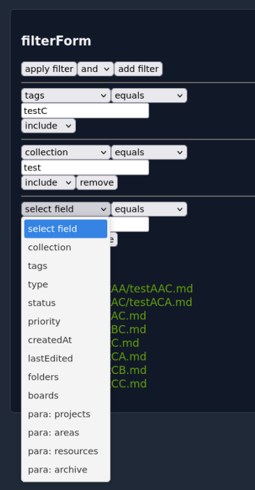
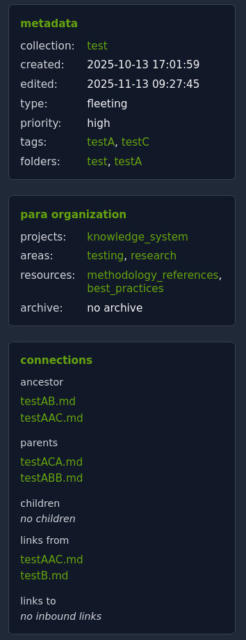

# KNOV - Knowledge Management System

KNOV (knowledge vault) is a flexible knowledge management system.

# Core Features

- **Offline Available for all OS**
  - One Executable which can be carried on a USB Stick
  - Docker Version available
- **Theme System**: 
  - Static assets and builtin theme assets are embedded in the binary for portable deployment.
  - builtin theme is unpacked on startup into the `KNOV_THEMES_PATH`
  - theme overwrite of specific templates
- **Search**
  - Strong Filter to display certain Files based on metadata
  - Multiple search backends (memory, grep, SQLite)

- **Flat Files + GIT Integration**: 
  - Version control for your knowledge base with GIT
  - All your data in a git repo available as files and also accessible via text-editor/ide
  - different methods to add files
    - via app with a button
    - via file browser
    - via git push
- **Dashboard System**: 
  - Customizable dashboards with a lot of widgets to display your data like you want
- **Multi-language Support**:
  - currently English and German translations
- **Organization with Metadata**: each file can get a lot of metadata for searching/filtering (but its not forced) - each method can be used independently and together
  - **Tags**: fully customizable tags
  - **PARA**: implemented [PARA](https://fortelabs.com/blog/para/) Method - you can attach each File with its corresponding PARA with multiple PARAS possible
  - **ZK**: Different Filetypes accordingly to the [Zettelkasten](https://zettelkasten.de/overview/) Method
  - **collection**: organizational field to group related files - defaults to the first folder in filepath or "default" - can be changed manually
  - **connections**: 
    - give a file a parent - the sytem automatically creates a connection system with a `Ancestor`, `Parents` and `Childs`
    - use markdown links in the content and you get `links to - inbound links` and `links from - outbound links`
  - **folders**: use a default Folder structure to get the filepath as well as see all folders clickable in the metadata

# Configuration

Configuration of the APP via ENV Variables.
KNOV can be deployed as a single binary with configurable paths:

- `KNOV_DATA_PATH`: Where your content files are stored
- `KNOV_THEMES_PATH`: Where theme .so files are located
- `KNOV_CONFIG_PATH`: Where configuration and user settings are stored
- `KNOV_SERVER_PORT`: HTTP server port

# Settings

Settings are stored as .json files in the `KNOV_CONFIG_PATH` for each user individually

# Architecture

- **Backend**: Go with Chi router
- **Frontend**: HTMX + Go HTML templates
- **Storage**: JSON-based configuration storage

# PKMS

zk/zettelkasten = stage of development
para = purpose/context
